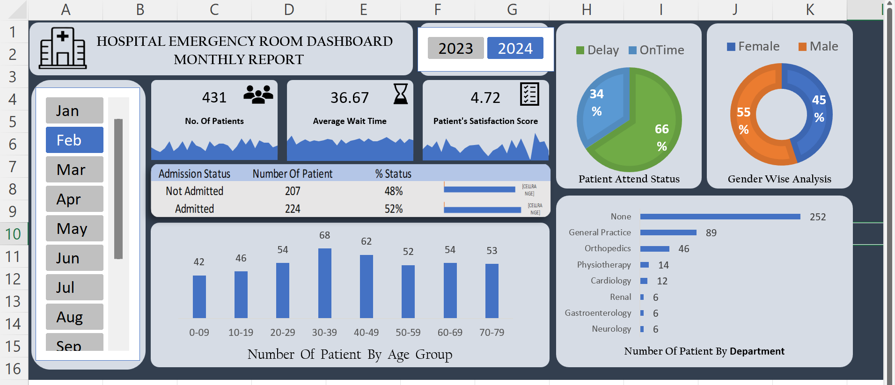

# 🏥 Hospital Emergency Room Data Analysis & Dashboard (Excel)

## 📌 Overview

This project analyzes hospital emergency room data using Microsoft Excel to monitor patient flow, identify operational bottlenecks, and support data-driven decision-making in healthcare management.

---

## 🎯 Business Problem

Hospitals need to efficiently manage patient volume and reduce waiting time to improve service quality. This project aims to analyze ER data to identify peak load periods, patient trends, and performance gaps.

---

## 📊 Key Metrics (KPIs)

* Total Patients → Total number of ER visits  
* Average Wait Time → Average time patients wait before being attended  
* Patient Satisfaction Score → Rating based on patient feedback  

---

## 📈 Dashboard Features

* 📅 Time-based filtering (Month & Year)
* 📊 Department-wise patient distribution
* 👥 Gender and age group analysis
* ⏱️ Wait time and patient flow tracking

---

## 📊 Key Insights

- Majority of patients are attended on time (~66%), but a significant portion still experiences delays (~34%)
- Male patients (55%) slightly outnumber female patients (45%)
- Highest patient volume is observed in the 30–39 age group
- General Practice handles the highest number of patients among departments
- Admission rate is slightly higher than non-admission, indicating moderate severity cases

---

## 💡 Business Impact

* Helps optimize staff allocation during peak hours
* Reduces patient wait time through better planning
* Improves hospital operational efficiency

---

## 🛠️ Tools Used

* Microsoft Excel  
* Pivot Tables  
* Slicers & Interactive Filters  
* Data Cleaning  

---

## 📸 Dashboard Preview

---

## 🚀 Future Improvements

* Integrate real-time data
* Connect with Power BI / Tableau
* Apply predictive analytics for patient flow forecasting

---

## 🙌 Note

This project demonstrates practical application of data analysis and dashboarding techniques to solve real-world healthcare problems.
